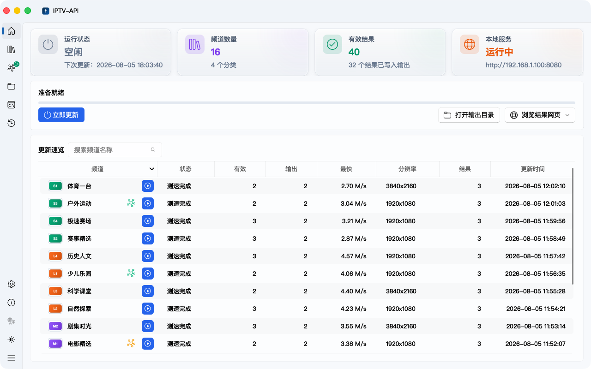
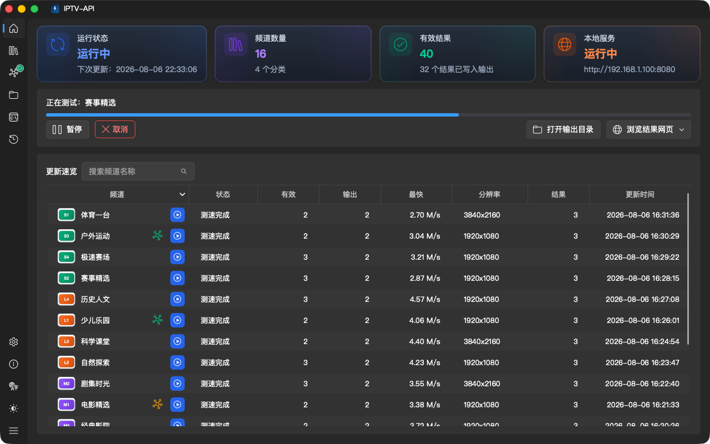

<div align="center">
  
</div>

<h1 align="center">IPTV-API</h1>

<p align="center">
  ⚡️IPTV直播源自动更新工具，支持自动采集、多源聚合、可用性校验、测速筛选与播放列表生成。可通过丰富配置自定义频道结果，并以 M3U、TXT 或 API 接口形式输出，导入播放器即可观看。
</p>

<p align="center">
  <a href="https://trendshift.io/repositories/12327" target="_blank"></a>
  <a href="https://trendshift.io/repositories/12327?utm_source=trendshift-badge&amp;utm_medium=badge&amp;utm_campaign=badge-trendshift-12327" target="_blank" rel="noopener noreferrer"></a>
  <a href="https://www.star-history.com/guovin/iptv-api">
    <picture><source media="(prefers-color-scheme: dark)" srcset="https://api.star-history.com/badge?repo=Guovin/iptv-api&type=rank&theme=dark" /><source media="(prefers-color-scheme: light)" srcset="https://api.star-history.com/badge?repo=Guovin/iptv-api&type=rank" /></picture>
  </a>
</p>

<p align="center">
  <a href="https://github.com/Guovin/iptv-api/releases/latest">
    
  </a>
  <a href="https://www.python.org/">
    
  </a>
  <a href="https://github.com/Guovin/iptv-api/releases/latest">
    
  </a>
  <a href="https://hub.docker.com/repository/docker/guovern/iptv-api">
    
  </a>
  <a href="https://github.com/Guovin/iptv-api/stargazers">
    
  </a>
  <a href="https://github.com/Guovin/iptv-api/fork">
    
  </a>
</p>

<div align="center">

[English](./README_en.md) | 中文

</div>

<div align="center">
  <picture>
    <source media="(prefers-color-scheme: dark)" srcset="./docs/images/desktop-ui-dark.png">
    <source media="(prefers-color-scheme: light)" srcset="./docs/images/desktop-ui.png">
    
  </picture>
  <details>
    <summary>🌓 切换显示模式</summary>
    <picture>
      <source media="(prefers-color-scheme: dark)" srcset="./docs/images/desktop-ui.png">
      <source media="(prefers-color-scheme: light)" srcset="./docs/images/desktop-ui-dark.png">
      
    </picture>
  </details>
  <sub><strong>Windows / macOS 桌面 GUI</strong> · 界面直观，操作更高效</sub>
</div>

<details open>
<summary><strong>目录</strong></summary>

- [✅ 核心特性](#核心特性)
- [⚙️ 配置参数](#配置)
- [🚀 快速上手](#快速上手)
    - [配置与结果目录](#配置与结果目录)
    - [工作流](#工作流)
    - [命令行](#命令行)
    - [GUI 软件](#gui-软件)
    - [Docker](#docker)
- [📚 文档中心](./docs/README.md)
- [📖 详细教程](./docs/tutorial.md)
- [🗓️ 更新日志](./CHANGELOG.md)
- [👀 关注](#关注)
- [❤️ 捐赠](#捐赠)
- [⚠️ 免责声明](#免责声明)
- [⚖️ 许可证](#许可证)

</details>

## 赞助商

<p align="center">
  <a href="https://www.ipwo.net/?ref=githubGuovin">
    
  </a>
</p>
<p align="center">
  <sub>
    <a href="https://www.ipwo.net/?ref=githubGuovin"><strong>IPWO</strong></a> 提供稳定的住宅代理网络，适用于公开数据采集、接口调试、自动化测试与多地区访问验证等合规场景。
    支持 HTTP / HTTPS / SOCKS5，优惠码：<strong><code>0105</code></strong>。
    请在合法授权并遵守目标站点条款的前提下使用。
  </sub>
</p>

<p align="center">
  <a href="mailto:360996299@qq.com?subject=%E6%88%90%E4%B8%BA%E8%B5%9E%E5%8A%A9%E5%95%86">成为赞助商</a>
</p>

> [!IMPORTANT]
> 1. 前往[`Govin`公众号](#微信公众号)回复`cdn`获取加速地址，提升订阅源与频道图标等资源的访问速度
> 2. 本项目不提供数据源，请自行添加后生成结果（[如何添加数据源？](./docs/tutorial.md#添加数据源与更多)）
> 3. 生成结果质量取决于数据源与网络环境等因素，请合理调整[配置参数](#配置)以获取更符合需求的结果

## 核心特性

| 功能        | 支&#8288;持&#8288;状&#8288;态 | 说明                                         |
|:----------|:----:|:-------------------------------------------|
| **自&#8288;定&#8288;义&#8288;模&#8288;板** |  ✅   | 生成自己想要的频道菜单                                |
| **频&#8288;道&#8288;别&#8288;名**  |  ✅   | 提升频道结果获取量与准确率，支持正则表达式                      |
| **多&#8288;源&#8288;聚&#8288;合**  |  ✅   | 本地源、订阅源（支持设置UA，识别无效地址并自动停用）                |
| **推&#8288;流**    |  ✅   | 改善弱网播放体验，支持浏览器直接播放，自动转码适配                  |
| **回&#8288;放&#8288;类&#8288;接&#8288;口** |  ✅   | 回放类接口的获取与生成                                |
| **EPG**   |  ✅   | 获取并显示频道预告内容                                |
| **频&#8288;道&#8288;台&#8288;标**  |  ✅   | 自定义频道台标，支持本地添加或远程库                         |
| **测&#8288;速&#8288;验&#8288;效**  |  ✅   | 获取延迟、速率、分辨率、帧率，过滤无效接口，支持实时输出结果             |
| **播&#8288;放&#8288;截&#8288;图**  |  ✅   | 可选自动截图，辅助验证频道内容，支持 GUI 预览与批量刷新 |
| **广&#8288;告&#8288;过&#8288;滤**  |  ✅   | 自动识别并过滤无信号/广告等循环占位源                        |
| **高&#8288;级&#8288;偏&#8288;好**  |  ✅   | 速率、分辨率、黑/白名单、归属地与运营商自定义过滤                  |
| **结&#8288;果&#8288;管&#8288;理**  |  ✅   | 结果分类存储与访问、日志记录、未匹配频道记录、统计分析、冻结过滤/解冻回归、数据缓存 |
| **定&#8288;时&#8288;任&#8288;务**  |  ✅   | 定时或间隔执行更新                                  |
| **暂&#8288;停&#8288;与&#8288;继&#8288;续** |  ✅   | 桌面端更新过程中可暂停，并从当前进度继续                         |
| **多&#8288;平&#8288;台&#8288;部&#8288;署** |  ✅   | 工作流、命令行、GUI 软件、Docker (amd64/arm64/arm v7) |
| **更&#8288;多&#8288;功&#8288;能**  |  ✨   | 详见[配置参数](#配置)章节                            |

## 配置

> [!NOTE]\
> 以下配置项位于 `config/config.ini` 文件中，支持通过配置文件或环境变量修改，保存后重启即可生效。也可查看独立的[配置参数文档](./docs/config.md)。

<details>
<summary>点击展开查看配置参数</summary>

| 配置项                      | 描述                                                                                                                   | 默认值                                      |
|:-------------------------|:---------------------------------------------------------------------------------------------------------------------|:-----------------------------------------|
| open_update              | 开启更新，用于控制是否更新接口，若关闭则所有工作模式（获取接口和测速）均停止                                                                               | True                                     |
| open_unmatch_category    | 开启未匹配频道分类，未匹配 source_file 的频道会进入该分类并直接写入结果，不参与测速                                                                     | False                                    |
| open_empty_category      | 开启无结果频道分类，自动归类至底部                                                                                                    | False                                    |
| open_update_time         | 开启显示更新时间                                                                                                             | True                                     |
| open_url_info            | 开启显示接口说明信息，用于控制是否显示接口来源、分辨率、协议类型等信息，为 $ 符号后的内容，播放软件使用该信息对接口进行描述，若部分播放器（如 PotPlayer）不支持解析导致无法播放可关闭                    | False                                    |
| open_epg                 | 开启 EPG 功能，支持频道显示预告内容                                                                                                 | True                                     |
| open_subscribe_epg       | 开启从订阅源 m3u 头部 url-tvg/x-tvg-url 自动提取 EPG 地址，并入 EPG 源一起合并，无需手动维护 `config/epg.txt`；epg.txt 源优先，订阅源仅补充未覆盖频道；需 open_epg = True | True                                     |
| open_m3u_result          | 开启转换生成 m3u 文件类型结果链接，支持显示频道图标                                                                                         | True                                     |
| output_urls_limit       | 每个频道最终导出的接口数量；旧版 `urls_limit` 仍兼容                                                                           | 5                                        |
| update_time_position     | 更新时间显示位置，需要开启 open_update_time 才能生效，可选值: top、bottom；top: 显示于结果顶部，bottom: 显示于结果底部                                     | top                                      |
| language                 | 系统语言设置；可选值: zh_CN、en                                                                                                 | zh_CN                                    |
| update_mode              | 定时执行更新时间模式，不作用于工作流；可选值: interval、time； interval: 按间隔时间执行，time: 按指定时间点执行                                              | interval                                 |
| update_interval          | 定时执行更新时间间隔，仅在update_mode = interval时生效，单位小时，设置 0 或空则只运行一次                                                            | 12                                       |
| update_times             | 定时执行更新时间点，仅在update_mode = time时生效，格式 HH:MM，支持多个时间点逗号分隔                                                               |                                          |
| update_startup           | 启动时执行更新，用于控制程序启动后是否立即执行一次更新                                                                                          | True                                     |
| time_zone                | 时区，可用于控制定时执行时区或显示更新时间的时区；可选值: Asia/Shanghai 或其它时区编码                                                                  | Asia/Shanghai                            |
| source_file              | 模板文件路径                                                                                                               | config/demo.txt                          |
| final_file               | 生成结果文件路径                                                                                                             | output/result.txt                        |
| open_realtime_write      | 开启实时写入结果文件，在测速过程中可以访问并使用更新结果                                                                                         | True                                     |
| open_service             | 开启页面服务，用于控制是否启动结果页面服务；如果使用青龙等平台部署，有专门设定的定时任务，需要更新完成后停止运行，可以关闭该功能                                                     | True                                     |
| service_port             | HTTP 服务访问端口；桌面版启用推流时由 Nginx 监听，新配置通常只需修改此端口                                                                    | 8080                                     |
| public_url               | 推荐的公网完整访问地址，例如 `https://iptv.example.com` 或 `http://host:8088`；用于统一生成播放列表、EPG、台标和服务链接                                |                                          |
| app_port                 | 高级兼容设置：Flask 内部 API 端口，通常无需修改，也不应作为用户访问端口                                                                        | 5180                                     |
| public_scheme            | 高级兼容设置：旧版公网协议，仅在 `public_url` 留空时生效；可选值: http、https                                                            | http                                     |
| public_domain            | 高级兼容设置：旧版公网 Host，仅在 `public_url` 留空时生效，默认使用本机 IP                                                                 | 127.0.0.1                                |
| cdn_url                  | CDN 代理加速地址，用于订阅源、频道图标等资源的加速访问；支持配置多个（用英文逗号分隔），订阅源与 EPG 按顺序逐个回退拉取，任一镜像成功即停，频道图标使用第一个地址                                                                                        |                                          |
| http_proxy               | HTTP 代理地址，用于获取订阅源等网络请求                                                                                               |                                          |
| open_local               | 开启本地源功能，将使用模板文件与本地源文件（local.txt）中的数据                                                                                 | True                                     |
| open_subscribe           | 开启订阅源功能                                                                                                              | True                                     |
| open_auto_disable_source | 开启自动停用失效地址，当请求重试后失败、内容为空或没有匹配到符合条件的值时，会自动在 `config/subscribe.txt` 和 `config/epg.txt` 中对应地址前添加 # 进行停用                 | False                                    |
| open_history             | 开启使用历史更新结果（包含模板与结果文件的接口），合并至本次更新中                                                                                    | True                                     |
| open_headers             | 开启使用 M3U 内含的请求头验证信息，用于测速等操作，个别播放器可能不支持播放这类含验证信息的接口                                                          | True                                     |
| user_agent               | 全局请求 User-Agent，用于拉取订阅源、测速以及写入 m3u 结果（无需开启 open_headers），留空则使用内置默认 UA；优先级：接口自带 UA > 订阅地址 UA > 全局 UA > 内置默认 UA                            |                                          |
| open_speed_test          | 开启测速功能，获取响应时间、速率、分辨率                                                                                                 | True                                     |
| speed_test_mode          | 测速工作模式：`quick`、`full` 或 `manual`；`manual` 仅采集候选，测速由 GUI 操作触发                                                       | quick                                    |
| speed_test_target        | 快速测速每个频道的有效结果目标；设为 `0` 跟随 `output_urls_limit`                                                                 | 0                                        |
| quick_test_target        | `speed_test_target` 的可读别名；非 0 时优先作为快速测速目标                                                               | 0                                        |
| open_stream_screenshot   | 自动为可播放候选接口获取播放截图；会增加 FFmpeg 解码开销和更新时间，关闭时仍可在 GUI 手动获取                                             | False                                    |
| stream_screenshot_timeout | 单个接口截图超时时长，单位秒(s)                                                                                                          | 5                                        |
| stream_screenshot_width  | 播放截图最大宽度，按原始宽高比缩放                                                                                                       | 640                                      |
| open_filter_resolution   | 开启分辨率过滤，低于最小分辨率（min_resolution）的接口将会被过滤，GUI 用户需要手动安装 FFmpeg，程序会自动调用 FFmpeg 获取接口分辨率，推荐开启，虽然会增加测速阶段耗时，但能更有效地区分是否可播放的接口 | True                                     |
| open_filter_speed        | 开启速率过滤，低于最小速率（min_speed）的接口将会被过滤                                                                                     | True                                     |
| open_filter_ad           | 开启广告过滤，自动识别并过滤无信号/广告等循环占位源（含 #EXT-X-ENDLIST 的短循环列表，或片段地址包含广告关键字），复用测速阶段已抓取的播放列表进行判断，不增加额外请求与测速耗时                            | True                                     |
| open_full_speed_test     | 开启全量测速，频道下所有候选接口（白名单除外）都进行测速；关闭时达到 `speed_test_target` 后停止该频道剩余测速                   | False                                    |
| open_supply              | 开启补偿机制模式，用于控制当频道接口数量不足时，自动将不满足条件（例如低于最小速率）但可能可用的接口添加至结果中，从而避免结果为空的情况；开启后，不符合 location/isp 归属地或运营商的接口也不再直接丢弃，而是降权排到该频道结果的末尾作为补充                                                 | False                                    |
| sort_by                  | 结果排序维度，控制每个频道内接口的排序优先级，按从前到后的顺序依次比较，逗号分隔；可选值: speed（速率，高优先）、delay（延迟，低优先）、resolution（分辨率，高优先），例如: resolution,speed                                              | speed                                    |
| min_resolution           | 接口最小分辨率，需要开启 open_filter_resolution 才能生效                                                                             | 1280x720                                 |
| max_resolution           | 接口最大分辨率，需要开启 open_filter_resolution 才能生效                                                                             | 3840x2160                                |
| min_speed                | 接口最小速率（单位 MiB/s），需要开启 open_filter_speed 才能生效                                                                         | 0.5                                      |
| resolution_speed_map     | 分辨率与速率映射关系，用于控制不同分辨率接口的最低速率要求，格式为 resolution:speed，多个映射关系逗号分隔                                                        | 1280x720:0.2,1920x1080:0.5,3840x2160:1.0 |
| performance_mode        | 性能模式；`auto` 根据设备或容器的 CPU、内存自动选择，`powersave` 优先降低资源消耗，`balance` 平衡资源与速度，`fast` 充分利用高性能设备                                                | auto                                     |
| speed_test_limit         | 测速网络并发高级覆盖值；`0` 表示由性能模式自动决定，大于 `0` 时覆盖自动测速并发，不影响媒体探测和源抓取并发                                                                        | 0                                        |
| speed_test_timeout       | 单个接口测速超时时长，单位秒(s)；数值越大测速所需时间越长，能提高获取接口数量，但质量会有所下降；数值越小测速所需时间越短，能获取低延时的接口，质量较好；调整此值能优化更新时间                            | 10                                       |
| speed_test_filter_host   | 测速阶段使用 Host 地址进行过滤，相同 Host 地址的频道将共用测速数据，开启后可大幅减少测速所需时间，但可能会导致测速结果不准确                                                 | False                                    |
| request_timeout          | 查询请求超时时长，单位秒(s)，用于控制查询接口文本链接的超时时长以及重试时长，调整此值能优化更新时间                                                                  | 10                                       |
| ipv6_support             | 强制认为当前网络支持 IPv6，跳过检测                                                                                                 | False                                    |
| ipv_type                 | 生成结果中接口的协议类型；可选值: ipv4、ipv6、all                                                                                      | all                                      |
| ipv_type_prefer          | 接口协议类型偏好，优先将该类型的接口排在结果前面；可选值: ipv4、ipv6、auto                                                                         | auto                                     |
| location                 | 接口归属地，用于控制结果只包含填写的归属地类型，支持关键字过滤，英文逗号分隔，不填写表示不指定归属地，建议使用靠近使用者的归属地，能提升播放体验                                             |                                          |
| isp                      | 接口运营商，用于控制结果中只包含填写的运营商类型，支持关键字过滤，英文逗号分隔，不填写表示不指定运营商                                                                  |                                          |
| origin_type_prefer       | 结果偏好的接口来源，结果优先按该顺序进行排序，逗号分隔，例如: local,subscribe；不填写则表示不指定来源，按照接口速率排序                                                 |                                          |
| local_num                | 结果中偏好的本地源接口数量                                                                                                        | 10                                       |
| subscribe_num            | 结果中偏好的订阅源接口数量                                                                                                        | 10                                       |
| logo_url                 | 频道台标库地址                                                                                                              |                                          |
| logo_type                | 频道台标文件类型                                                                                                             | png                                      |
| open_subscribe_logo      | 开启优先使用订阅源 m3u 中自带的 tvg-logo 台标地址，仅当订阅源未提供时才回退到台标库                                                                        | True                                     |
| open_rtmp                | 开启 RTMP 推流功能，仅建议用于自有或已授权内容，需要安装 FFmpeg，利用本地带宽提升接口播放体验                                                                    | True                                     |
| nginx_http_port          | 高级兼容设置：旧版 HTTP 端口名；新配置请使用 `service_port`                                                                            | 8080                                     |
| nginx_rtmp_port          | 高级设置：Nginx RTMP 协议端口，仅推流客户端需要                                                                                       | 1935                                     |
| rtmp_idle_timeout        | RTMP 频道接口空闲停止推流超时时长，单位秒(s)，用于控制接口无人观看时超过该时长后停止推流，调整此值能优化服务器资源占用                                                      | 300                                      |
| rtmp_max_streams         | RTMP 推流最大并发数量，用于控制同时推流的频道数量，数值越大服务器压力越大，调整此值能优化服务器资源占用                                                               | 10                                       |
| rtmp_transcode_mode      | 推流转码模式，copy 则不进行转码，以复制方式输出，可以最大程度节省CPU消耗，auto 则自适应匹配播放器进行转码，会增加CPU消耗但能提升兼容性                                          | copy                                     |

</details>

## 快速上手

### 配置与结果目录

```
iptv-api/                  # 项目根目录
├── config                 # 配置文件目录，包含配置文件、模板文件等
│   └── hls                # 本地HLS推流文件目录，用于存放多个频道名称命名的视频文件
│   └── local              # 本地源文件目录，用于存放多个本地源文件，支持txt/m3u格式
│   └── config.ini         # 配置参数文件
│   └── demo.txt           # 频道模板
│   └── alias.txt          # 频道别名
│   └── blacklist.txt      # 接口黑名单
│   └── whitelist.txt      # 接口白名单
│   └── subscribe.txt      # 频道订阅源列表
│   └── local.txt          # 本地源文件
│   └── epg.txt            # EPG订阅源列表
└── output                 # 结果文件目录，包含生成的结果文件等
    └── data               # 结果数据缓存目录
    └── epg                # EPG结果目录
    └── ipv4               # IPv4结果目录
    └── ipv6               # IPv6结果目录
    └── result.m3u/txt     # m3u/txt结果
    └── hls.m3u/txt        # RTMP hls推流结果
    └── log                # 日志文件目录
        └── log.log        # 带时间、级别和运行 ID 的运行日志
        └── runtime.jsonl  # 结构化运行事件
        └── result.log     # 有效结果日志
        └── speed_test.log # 测速日志
        └── statistic.log  # 统计结果日志
        └── unmatch.log    # 未匹配频道记录
        └── *.jsonl        # 对应日志的结构化 JSON Lines 版本
```

### 工作流

Fork 本项目并开启工作流更新，具体步骤请见[详细教程](./docs/tutorial.md)

### 命令行

```shell
pip install pipenv
```

```shell
pipenv install --dev
```

启动更新：

```shell
pipenv run dev
```

启动服务：

```shell
pipenv run service
```

### GUI 软件

新版桌面 GUI 是 Windows 与 macOS 当前唯一受支持的图形界面，提供一键更新、实时进度、频道与结果管理、重新测速、RTMP 推流监控、数据源配置及任务历史。Docker 部署使用 Web 结果页，不包含此桌面界面。

安装依赖并启动桌面端：

```shell
pipenv install --dev
pipenv run ui
```

构建当前平台的安装包：

```shell
pipenv run ui_build
```

> [!WARNING]
> 旧版 Tkinter 界面已弃用，仅为兼容现有用户而临时保留，并将在后续版本中移除。该界面不再维护、修复问题或新增功能；过渡期间仍可通过 `pipenv run legacy_ui` 启动，并通过 `pipenv run legacy_ui_build` 打包。

分辨率检测需要系统安装 FFmpeg。Windows 可使用随包提供的 nginx-rtmp；macOS 会自动检测系统中带 RTMP 模块的 nginx，也可通过 `IPTV_API_NGINX_PATH` 和 `IPTV_API_NGINX_RTMP_MODULE` 指定可执行文件与动态模块。

### Docker

#### 1. Compose 部署（推荐）

下载[docker-compose.yml](./docker-compose.yml)或复制内容创建（内部参数可按需更改），在文件所在路径下运行以下命令即可部署：

```bash
docker compose up -d
```

#### 2. 手动命令部署

##### （1）拉取镜像

```bash
docker pull guovern/iptv-api:latest
```

> [!CAUTION]
> 若官方镜像拉取失败，可使用以下代理加速地址；它可能提供旧版本镜像。

```bash
docker pull docker.1ms.run/guovern/iptv-api:latest
```

##### （2）运行容器

```bash
docker run -d -p 80:8080 guovern/iptv-api
```

**环境变量：**

| 变量              | 描述                                                | 默认值       |
|:----------------|:--------------------------------------------------|:----------|
| PUBLIC_URL      | 推荐：完整公网地址，例如 `http://192.168.1.10` 或 `https://iptv.example.com` |           |
| PUBLIC_DOMAIN   | 兼容配置：`PUBLIC_URL` 留空时使用的公网域名或 IP                    | 127.0.0.1 |
| PUBLIC_PORT     | 兼容配置：`PUBLIC_URL` 留空时使用的宿主机映射端口                    | 80        |
| NGINX_HTTP_PORT | 高级兼容配置：容器内部 HTTP 端口，通常保持默认                        | 8080      |

> [!NOTE]
> 当宿主机/Docker 已启用 IPv6 时，容器会自动同时监听 IPv6 地址，无需额外配置；纯 IPv4 或禁用 IPv6 的环境则自动跳过。

如果需要修改环境变量，在上述运行命令后添加以下参数：

```bash
# 推荐：直接设置完整公网地址
-e PUBLIC_URL=https://iptv.example.com
```

使用仓库中的 Compose 文件时，只需通过 `PORT` 修改宿主机端口，例如
`PORT=8088 docker compose up -d`；Compose 会同时更新端口映射和兼容的 `PUBLIC_PORT`。
未设置或留空的 `PUBLIC_URL` 不会覆盖挂载配置文件中的 `public_url`。

除了以上环境变量，还支持通过环境变量覆盖配置文件中的[配置项](#配置)

**挂载：** 实现宿主机文件与容器文件同步，修改模板、配置、获取更新结果文件可直接在宿主机文件夹下操作，在上述运行命令后添加以下参数

```bash
# 挂载配置目录
-v /iptv-api/config:/iptv-api/config
# 挂载结果目录
-v /iptv-api/output:/iptv-api/output
```

##### 3. 更新结果

| 接口              | 描述          |
|:----------------|:------------|
| /               | 默认接口        |
| /m3u            | m3u 格式接口    |
| /txt            | txt 格式接口    |
| /ipv4           | ipv4 默认接口   |
| /ipv6           | ipv6 默认接口   |
| /ipv4/txt       | ipv4 txt接口  |
| /ipv6/txt       | ipv6 txt接口  |
| /ipv4/m3u       | ipv4 m3u接口  |
| /ipv6/m3u       | ipv6 m3u接口  |
| /content        | 接口文本内容      |
| /log/result     | 有效结果的日志     |
| /log/speed-test | 所有参与测速接口的日志 |
| /log/statistic  | 统计结果的日志     |
| /log/unmatch    | 未匹配频道的日志    |

日志接口默认返回兼容的纯文本格式；添加 `?format=jsonl` 可获取结构化 JSON Lines。CLI 在交互式终端使用动态多任务进度，Docker、CI、重定向输出或设置 `IPTV_API_PLAIN_OUTPUT=1` 时自动使用稳定的逐行输出。

**RTMP 推流：**

> [!WARNING]
> 开启推流后会默认推流获取到的接口（如订阅源）。请仅对你有明确授权、可合法分发或仅用于内部测试的内容启用该功能。在中国大陆使用时，请特别确认内容授权、版权、网络视听与广播电视等相关合规要求；不要将本项目用于传播、转发或公开分发未经授权的直播源/节目源。

如果是服务器部署，建议通过 `PUBLIC_URL` 配置完整公网地址；旧版 `PUBLIC_DOMAIN` 与 `PUBLIC_PORT` 仍兼容。若需推流本地视频源，可在 `config` 目录下新建 `hls` 文件夹，将以频道名称命名的视频文件放入其中，程序会自动推流到对应频道中。

| 推流接口          | 描述           |
|:--------------|:-------------|
| /hls          | 推流接口         |
| /hls/txt      | 推流txt接口      |
| /hls/m3u      | 推流m3u接口      |
| /hls/ipv4     | 推流ipv4 默认接口  |
| /hls/ipv6     | 推流ipv6 默认接口  |
| /hls/ipv4/txt | 推流ipv4 txt接口 |
| /hls/ipv4/m3u | 推流ipv4 m3u接口 |
| /hls/ipv6/txt | 推流ipv6 txt接口 |
| /hls/ipv6/m3u | 推流ipv6 m3u接口 |
| /stat         | 推流状态统计接口     |

[如何使用推流？](./docs/tutorial.md#推流使用教程)

## 更新日志

[更新日志](./CHANGELOG.md)

## 关注

### GitHub

关注我的 GitHub 账号 [Guovin](https://github.com/Guovin)，获取更多实用项目

### 微信公众号

微信公众号搜索 Govin，或扫码，接收更新推送、学习更多使用技巧：


### 联系我

联系邮箱：[360996299@qq.com](mailto:360996299@qq.com)

## 捐赠

<div>开发维护不易，请我喝杯咖啡☕️吧~</div>

[](https://ko-fi.com/govin)

| 支付宝                                  | 微信                                      |
|--------------------------------------|-----------------------------------------|
|  |  |

## 免责声明

- 本项目仅为工具/框架，不包含或提供任何直播源、受版权保护的节目或其他第三方内容，也不托管、缓存或承诺任何可用内容。用户需自行添加数据源，并确保所使用的数据源及其获取、转发、播放行为符合所在地区法律法规。
- 使用者对通过本项目获取、分发或播放的内容独立负责。请勿将本项目用于传播、分发、聚合、转播或观看未经授权的受版权保护内容，尤其是在中国大陆地区使用时，更应确保内容授权、平台资质、备案/许可及其他监管要求均已满足。
- 本项目提供的 RTMP/HLS 推流仅用于自有内容、已获授权内容或封闭环境下的技术测试；如果你无法确认授权状态，请关闭 `open_rtmp`，不要对公网开放相关接口。
- 在使用本项目时，应遵守当地相关法律法规与监管要求。作者不对因用户使用本项目而产生的任何法律责任承担责任。
- 商业、企业或生产环境使用前建议咨询合规/法律顾问并完成审查。

## 许可证

[AGPL-3.0](./LICENSE) License &copy; 2024-PRESENT [Govin](https://github.com/guovin)

> [!IMPORTANT]
> 本项目采用 AGPL-3.0。若将修改后的程序作为网络服务、公开容器镜像或以其他对外服务方式运行，须向使用者提供包括修改在内的完整源代码。详见：https://www.gnu.org/licenses/agpl-3.0.html
