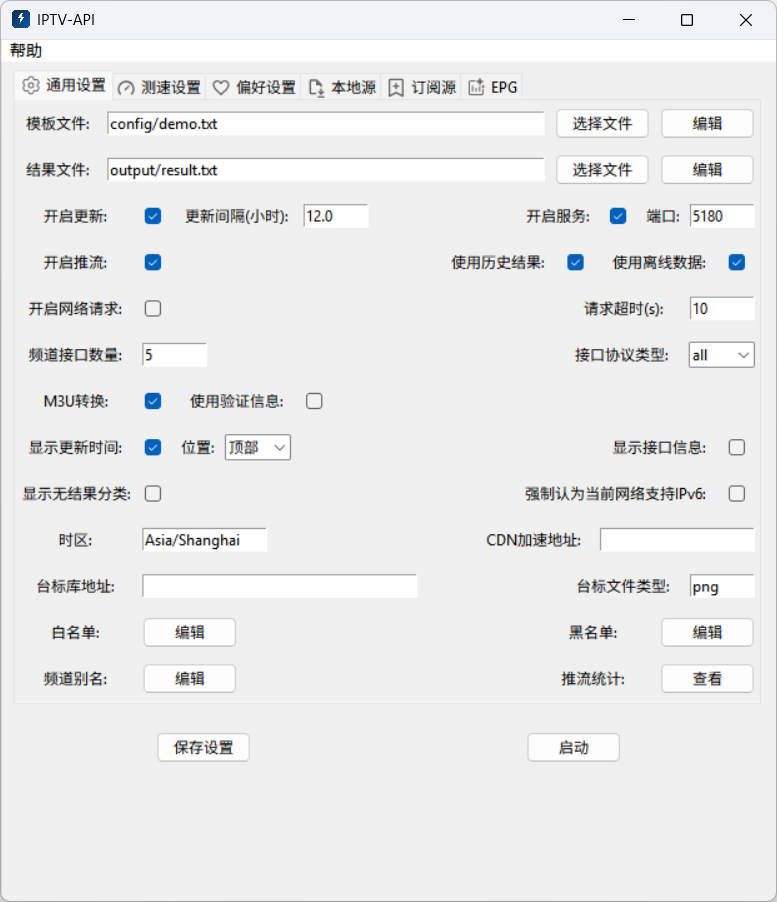

<div align="center">
  
</div>

<p>
    <br>
    ⚡️ IPTV live-source automatic update platform — 🤖 fully automated collection, filtering, speed-testing, and generation 🚀. Supports extensive personalized configuration; paste the resulting address into a player to watch.
</p>

<p align="center">
    <br>
    <a href="https://trendshift.io/repositories/12327" target="_blank"></a>
</p>

<p align="center">
  <a href="https://github.com/Guovin/iptv-api/releases/latest">
    
  </a>
  <a href="https://www.python.org/">
    
  </a>
  <a href="https://github.com/Guovin/iptv-api/releases/latest">
    
  </a>
  <a href="https://hub.docker.com/repository/docker/guovern/iptv-api">
    
  </a>
  <a href="https://github.com/Guovin/iptv-api/fork">
    
  </a>
</p>

<div align="center">

[中文](./README.md) | English

</div>

- [✅ Core Features](#core-features)
- [⚙️ Config parameter](#Config)
- [🚀 Quick Start](#quick-start)
    - [Configuration and Results Directory](#configuration-and-results-directory)
    - [Workflow](#workflow)
    - [Command Line](#command-line)
    - [GUI Software](#gui-software)
    - [Docker](#docker)
- [📖 Detailed Tutorial](./docs/tutorial_en.md)
- [🗓️ Changelog](./CHANGELOG.md)
- [❤️ Donations](#donations)
- [👀 Follow](#follow)
- [⭐️ Star History](#star-history)
- [⚠️ Disclaimer](#disclaimer)
- [⚖️ License](#license)

> [!IMPORTANT]
> 1. ⚠️ Due to an excessive number of forks, GitHub resource usage has reached its limit, and the workflow has been
     changed to manual trigger. Please update [main.yml](./.github/workflows/main.yml) as soon as possible to remove the
     scheduled task; otherwise the workflow may be disabled!
> 2. Go to the `Govin` WeChat public account and reply with `cdn` to get an acceleration address to improve access speed
     for subscription sources and channel logos.
> 3. This project does not provide data sources. Please add your own before generating
     results. ([How to add data sources?](./docs/tutorial_en.md#Add-data-sources-and-more))
> 4. The quality of generated results depends on the data sources and network conditions; please adjust
     the [configuration](#Config) accordingly to obtain results that better meet your needs.

## Core Features

| Feature                       | Support | Description                                                                                                                                                 |
|:------------------------------|:-------:|:------------------------------------------------------------------------------------------------------------------------------------------------------------|
| **Custom templates**          |    ✅    | Generate custom channel playlists                                                                                                                           |
| **Channel aliases**           |    ✅    | Improve channel matching and accuracy, supports regular expressions                                                                                         |
| **Multi-source aggregation**  |    ✅    | Local sources and subscription sources                                                                                                                      |
| **Stream relay**              |    ✅    | Improve playback on weak networks, supports direct browser playback                                                                                         |
| **Replay/VOD interfaces**     |    ✅    | Fetching and generating replay/VOD interfaces                                                                                                               |
| **EPG**                       |    ✅    | Fetch and display channel program guides                                                                                                                    |
| **Channel logos**             |    ✅    | Custom channel logos, supports local additions or a remote library                                                                                          |
| **Speed test & validation**   |    ✅    | Obtain latency, bitrate, resolution; filter invalid interfaces; supports real-time output                                                                   |
| **Advanced preferences**      |    ✅    | Rate, resolution, blacklist/whitelist, location and ISP custom filters                                                                                      |
| **Results management**        |    ✅    | Categorized storage and access of results, log recording, unmatched channel records, statistical analysis, freeze filtering/unfreeze rollback, data caching |
| **Scheduled tasks**           |    ✅    | Scheduled or interval updates                                                                                                                               |
| **Multi-platform deployment** |    ✅    | Workflows, CLI, GUI, Docker (amd64/arm64/arm v7)                                                                                                            |
| **More features**             |    ✨    | See [Configuration](#Config) section for details                                                                                                            |

## Config

> [!NOTE]\
> The following configuration items are located in `config/config.ini` and can be modified via the configuration file or
> environment variables. Save changes and restart to apply.

| Configuration Item     | Description                                                                                                                                                                                                                                                                                                                                 | Default Value     |
|:-----------------------|:--------------------------------------------------------------------------------------------------------------------------------------------------------------------------------------------------------------------------------------------------------------------------------------------------------------------------------------------|:------------------|
| open_update            | Enable updates, used to control whether to update interfaces. If disabled, all working modes (getting interfaces and speed tests) stop.                                                                                                                                                                                                     | True              |
| open_empty_category    | Enable empty category, channels without results will automatically be classified to the bottom.                                                                                                                                                                                                                                             | False             |
| open_update_time       | Enable display of update time.                                                                                                                                                                                                                                                                                                              | True              |
| open_url_info          | Enable to display interface description information, used to control whether to display interface source, resolution, protocol type and other information (content after `$`). The player uses this information to describe the interface. If some players (such as PotPlayer) do not support parsing and cannot play, you can turn it off. | False             |
| open_epg               | Enable EPG function, support channel display preview content.                                                                                                                                                                                                                                                                               | True              |
| open_m3u_result        | Enable converting and generating m3u file type result links, supporting the display of channel icons.                                                                                                                                                                                                                                       | True              |
| urls_limit             | Number of interfaces per channel.                                                                                                                                                                                                                                                                                                           | 10                |
| update_time_position   | Update time display position, takes effect only when `open_update_time` is enabled. Optional values: `top`, `bottom`. `top`: display at the top of the result, `bottom`: display at the bottom.                                                                                                                                             | top               |
| language               | Application language setting; Optional values: zh_CN, en                                                                                                                                                                                                                                                                                    | zh_CN             |
| update_mode            | Scheduled execution update mode, does not apply to workflow; Optional values: interval, time; interval: execute by interval time, time: execute at specified time point                                                                                                                                                                     | interval          |
| update_interval        | Scheduled execution update interval, only takes effect when update_mode = interval, unit hours, set to 0 or empty to run only once                                                                                                                                                                                                          | 12                |
| update_times           | Scheduled execution update time point, only takes effect when update_mode = time, format HH:MM, supports multiple time points separated by commas                                                                                                                                                                                           |                   |
| update_startup         | Execute update at startup, used to control whether to execute an update immediately after the program starts                                                                                                                                                                                                                                | True              |
| time_zone              | Time zone, can be used to control the time zone for scheduled execution or display update time; Optional values: Asia/Shanghai or other time zone codes                                                                                                                                                                                     | Asia/Shanghai     |
| source_file            | Template file path.                                                                                                                                                                                                                                                                                                                         | config/demo.txt   |
| final_file             | Generated result file path.                                                                                                                                                                                                                                                                                                                 | output/result.txt |
| open_service           | Enable page service, used to control whether to start the result page service. If using platforms such as Qinglong with scheduled tasks, and you need the program to exit after update is finished, you can disable this.                                                                                                                   | True              |
| app_port               | Page service port, used to control the port number of the page service.                                                                                                                                                                                                                                                                     | 5180              |
| public_scheme          | Public network protocol. Optional values: `http`, `https`.                                                                                                                                                                                                                                                                                  | http              |
| public_domain          | Public network Host address, used to generate access URLs in the result; uses local machine IP by default.                                                                                                                                                                                                                                  | 127.0.0.1         |
| cdn_url                | CDN proxy acceleration address, used for accelerated access to subscription sources, channel icons and other resources.                                                                                                                                                                                                                     |                   |
| http_proxy             | HTTP proxy address, used for network requests such as obtaining subscription sources                                                                                                                                                                                                                                                        |                   |
| open_local             | Enable local source function, will use the data in the template file and the local source file (`local.txt`).                                                                                                                                                                                                                               | True              |
| open_subscribe         | Enable subscription source function.                                                                                                                                                                                                                                                                                                        | True              |
| open_history           | Enable using historical update results (including interfaces from template and result files), merged into this update.                                                                                                                                                                                                                      | True              |
| open_headers           | Enable using request header authentication information contained in M3U, used for speed test and other operations. Note: only a few players support playing such interfaces with authentication info, so it is disabled by default.                                                                                                         | False             |
| open_speed_test        | Enable speed test functionality to obtain response time, rate, and resolution.                                                                                                                                                                                                                                                              | True              |
| open_filter_resolution | Enable resolution filtering. Interfaces below the minimum resolution (`min_resolution`) will be filtered. GUI users need to manually install FFmpeg; the program will call FFmpeg to obtain interface resolution. Recommended to enable: although it increases speed test time, it more effectively distinguishes playable interfaces.      | True              |
| open_filter_speed      | Enable speed filtering. Interfaces below the minimum speed (`min_speed`) will be filtered.                                                                                                                                                                                                                                                  | True              |
| open_supply            | Enable compensation mechanism mode. When the number of channel interfaces is insufficient, interfaces that do not meet the conditions (such as lower than minimum speed) but may still be available will be added to the result to avoid empty results.                                                                                     | True              |
| min_resolution         | Minimum interface resolution, takes effect only when `open_filter_resolution` is enabled.                                                                                                                                                                                                                                                   | 1920x1080         |
| max_resolution         | Maximum interface resolution, takes effect only when `open_filter_resolution` is enabled.                                                                                                                                                                                                                                                   | 1920x1080         |
| min_speed              | Minimum interface speed (unit: M/s), takes effect only when `open_filter_speed` is enabled.                                                                                                                                                                                                                                                 | 0.5               |
| speed_test_limit       | Number of interfaces to test at the same time. Controls concurrency in the speed test stage. Larger values shorten speed test time but increase load and may reduce accuracy; smaller values increase time but reduce load and improve accuracy.                                                                                            | 10                |
| speed_test_timeout     | Single interface speed test timeout duration in seconds. Larger values increase speed test time and number of interfaces obtained (but with lower average quality); smaller values reduce time and favor low-latency, higher-quality interfaces.                                                                                            | 10                |
| speed_test_filter_host | Use Host address to de-duplicate speed tests. Channels with the same Host share speed test data. Enabling this can greatly reduce speed test time but may cause inaccurate results.                                                                                                                                                         | False             |
| request_timeout        | Query request timeout duration in seconds, used to control timeout and retry duration when querying interface text links. Adjusting this value can optimize update time.                                                                                                                                                                    | 10                |
| ipv6_support           | Force treating the current network as IPv6-supported and skip detection.                                                                                                                                                                                                                                                                    | False             |
| ipv_type               | Protocol type of interfaces in the generated result. Optional values: `ipv4`, `ipv6`, `all`.                                                                                                                                                                                                                                                | all               |
| ipv_type_prefer        | Interface protocol type preference. Preferred type will be ordered earlier in the result. Optional values: `ipv4`, `ipv6`, `auto`.                                                                                                                                                                                                          | auto              |
| location               | Interface location filter. Result will only contain interfaces whose location matches the given keywords (comma-separated). Leave empty to not restrict by location. Recommended to set near the end user to improve playback experience.                                                                                                   |                   |
| isp                    | Interface operator filter. Result will only contain interfaces whose operator matches the given keywords (comma-separated). Leave empty to not restrict by operator.                                                                                                                                                                        |                   |
| origin_type_prefer     | Preferred interface source ordering. The result is sorted in this order (comma-separated). Example: `local,subscribe`. Leave empty to not specify and sort by interface speed instead.                                                                                                                                                      |                   |
| local_num              | Preferred number of local source interfaces in the result.                                                                                                                                                                                                                                                                                  | 10                |
| subscribe_num          | Preferred number of subscription source interfaces in the result.                                                                                                                                                                                                                                                                           | 10                |
| logo_url               | Channel logo library URL.                                                                                                                                                                                                                                                                                                                   |                   |
| logo_type              | Channel logo file type.                                                                                                                                                                                                                                                                                                                     | png               |
| open_rtmp              | Enable RTMP push function. Requires FFmpeg installed, uses local bandwidth to improve playback experience.                                                                                                                                                                                                                                  | True              |
| nginx_http_port        | Nginx HTTP service port, used for the HTTP service of RTMP push forwarding.                                                                                                                                                                                                                                                                 | 8080              |
| nginx_rtmp_port        | Nginx RTMP service port, used for the RTMP service of RTMP push forwarding.                                                                                                                                                                                                                                                                 | 1935              |
| rtmp_idle_timeout      | RTMP channel idle stop-streaming timeout in seconds. When no one watches for longer than this duration, streaming is stopped, helping reduce server resource usage.                                                                                                                                                                         | 300               |
| rtmp_max_streams       | Maximum number of concurrent RTMP push streams. Controls how many channels can be pushed at the same time. Larger values increase server load; tune to optimize resource usage.                                                                                                                                                             | 10                |

## Quick Start

### Configuration and Results Directory

```
iptv-api/                  # Project root directory
├── config                 # Configuration files directory, includes config files, templates, etc.
│   └── hls                # Local HLS streaming files directory, used to store video files named after channel names
│   └── local              # Local source files directory; used to store multiple local source files; supports txt/m3u formats
│   └── config.ini         # Configuration parameters file
│   └── demo.txt           # Channel template
│   └── alias.txt          # Channel aliases
│   └── blacklist.txt      # Interface blacklist
│   └── whitelist.txt      # Interface whitelist
│   └── subscribe.txt      # Channel subscription sources list
│   └── local.txt          # Local source file
│   └── epg.txt            # EPG subscription sources list
└── output                 # Output files directory, includes generated result files, etc.
    └── data               # Result data cache directory
    └── epg                # EPG result directory
    └── ipv4               # IPv4 result directory
    └── ipv6               # IPv6 result directory
    └── result.m3u/txt     # m3u/txt result
    └── hls.m3u/txt        # RTMP hls stream result
    └── log                # Log files directory
        └── result.log     # Valid result log
        └── speed_test.log # Speed test log
        └── statistic.log  # Statistics result log
        └── nomatch.log    # Unmatched channel records
```

### Workflow

Fork this project and initiate workflow updates, detailed steps are available
at [Detailed Tutorial](./docs/tutorial_en.md)

### Command Line

```shell
pip install pipenv
```

```shell
pipenv install --dev
```

Start update:

```shell
pipenv run dev
```

Start service:

```shell
pipenv run service
```

### GUI Software

1. Download the [IPTV-API Update Software](https://github.com/Guovin/iptv-api/releases), open the software, and click
   Start to perform the update

2. Or run the following command in the project directory to open the GUI software:

```shell
pipenv run ui
```



### Docker

#### 1. Deployment with Compose (recommended)

Download the [docker-compose.yml](./docker-compose.yml) or create one by copying the content (internal parameters can
be changed as needed), then run the following command in the path where the file is located:

```bash
docker compose up -d
```

#### 2. Manual deployment with commands

##### (1) Pull the image

```bash
docker pull guovern/iptv-api:latest
```

🚀 Proxy acceleration (use this command if pulling fails, but it may download an older version):

```bash
docker pull docker.1ms.run/guovern/iptv-api:latest
```

##### (2) Run the container

```bash
docker run -d -p 80:8080 guovern/iptv-api
```

**Environment variables:**

| Variable        | Description                                                                                                      | Default   |
|:----------------|:-----------------------------------------------------------------------------------------------------------------|:----------|
| PUBLIC_DOMAIN   | Public domain or IP address, determines external access and the Host used in push stream results                 | 127.0.0.1 |
| PUBLIC_PORT     | Public port, set to the mapped port, determines external access address and the port used in push stream results | 80        |
| NGINX_HTTP_PORT | Nginx HTTP service port, needs to be mapped for external access                                                  | 8080      |

If you need to modify environment variables, add the following parameters after the above run command:

```bash
# Modify public domain
-e PUBLIC_DOMAIN=your.domain.com
# Modify public port
-e PUBLIC_PORT=80
```

In addition to the environment variables listed above, you can also override the [configuration items](#Config) in the
configuration file via environment variables.

**Mounts:** used to synchronize files between the host and the container. You can edit templates, configs, and access
generated result files directly on the host. Append the following options to the run command above:

```bash
# Mount config directory
-v /iptv-api/config:/iptv-api/config
# Mount output directory
-v /iptv-api/output:/iptv-api/output
```

##### 3. Update Results

| Endpoint        | Description                                     |
|:----------------|:------------------------------------------------|
| /               | Default endpoint                                |
| /m3u            | m3u format endpoint                             |
| /txt            | txt format endpoint                             |
| /ipv4           | ipv4 default endpoint                           |
| /ipv6           | ipv6 default endpoint                           |
| /ipv4/txt       | ipv4 txt endpoint                               |
| /ipv6/txt       | ipv6 txt endpoint                               |
| /ipv4/m3u       | ipv4 m3u endpoint                               |
| /ipv6/m3u       | ipv6 m3u endpoint                               |
| /content        | Endpoint content                                |
| /log/result     | Log of valid results                            |
| /log/speed-test | Log of all interfaces involved in speed testing |
| /log/statistic  | Log of statistics results                       |
| /log/nomatch    | Log of unmatched channels                       |

**RTMP Streaming:**

> [!NOTE]
> 1. If deploying on a server, be sure to set the `PUBLIC_DOMAIN` environment variable to the server's domain name or IP
     address and the `PUBLIC_PORT` environment variable to the public port; otherwise the streaming addresses will not
     be accessible.
> 2. When streaming is enabled, obtained interfaces (e.g., subscription sources) will be streamed by default.
> 3. To stream local video sources, create an `hls` folder under the `config` directory and place video files named
     after the channel; the program will automatically stream them to the corresponding channels.

| Streaming Endpoint | Description                          |
|:-------------------|:-------------------------------------|
| /hls               | hls streaming endpoint               |
| /hls/txt           | hls txt streaming endpoint           |
| /hls/m3u           | hls m3u streaming endpoint           |
| /hls/ipv4          | hls ipv4 default streaming endpoint  |
| /hls/ipv6          | hls ipv6 default streaming endpoint  |
| /hls/ipv4/txt      | hls ipv4 txt streaming endpoint      |
| /hls/ipv4/m3u      | hls ipv4 m3u streaming endpoint      |
| /hls/ipv6/txt      | hls ipv6 txt streaming endpoint      |
| /hls/ipv6/m3u      | hls ipv6 m3u streaming endpoint      |
| /stat              | Streaming status statistics endpoint |

## Changelog

[Changelog](./CHANGELOG.md)

## Follow

### GitHub

Follow my GitHub account [Guovin](https://github.com/Guovin) to find more useful projects

### WeChat public account

WeChat public account search for Govin, or scan the code to receive updates and learn more tips:


### Need more help?

Contact via email: `360996299@qq.com`

## Star History

[](https://starchart.cc/Guovin/iptv-api)

## Donations

<div>Development and maintenance are not easy, please buy me a coffee ~</div>

| Alipay                                | Wechat                                    |
|---------------------------------------|-------------------------------------------|
|  |  |

## Disclaimer

- This project is provided as a tool/framework only; it does not include or provide any live streams, copyrighted
  programs, or other third-party content. Users must add their own data sources and ensure that the data sources used
  and their use comply with applicable laws and regulations in their jurisdiction.
- Users are solely responsible for any content obtained, distributed, or played through this project. Do not use it to
  distribute, share, or watch copyrighted content without authorization.
- When using this project, comply with local laws, regulations, and supervisory requirements. The author is not liable
  for any legal responsibility arising from users' use of this project.
- For commercial, corporate, or production use, it is recommended to consult legal counsel and perform a compliance
  review.

## License

[MIT](./LICENSE) License &copy; 2024-PRESENT [Govin](https://github.com/guovin)
