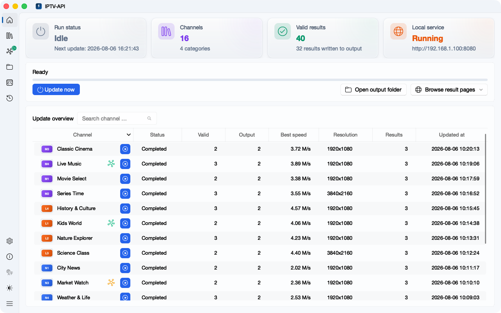
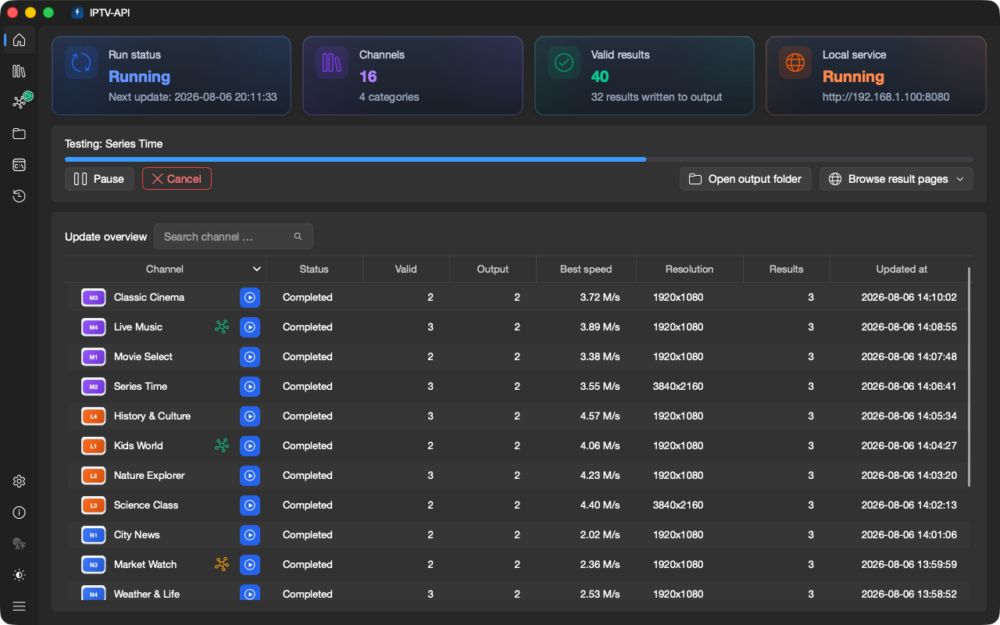

<div align="center">
  
</div>

<h1 align="center">IPTV-API</h1>

<p align="center">
    ⚡️ IPTV live-source automatic update tool that supports automatic collection, multi-source aggregation, availability validation, speed-test filtering, and playlist generation. Customize channel results with rich configuration, then output them as M3U, TXT, or API endpoints and import them into a player to watch.
</p>

<p align="center">
    <a href="https://trendshift.io/repositories/12327" target="_blank"></a>
    <a href="https://trendshift.io/repositories/12327?utm_source=trendshift-badge&amp;utm_medium=badge&amp;utm_campaign=badge-trendshift-12327" target="_blank" rel="noopener noreferrer"></a>
</p>

<p align="center">
  <a href="https://github.com/Guovin/iptv-api/releases/latest">
    
  </a>
  <a href="https://www.python.org/">
    
  </a>
  <a href="https://github.com/Guovin/iptv-api/releases/latest">
    
  </a>
  <a href="https://hub.docker.com/repository/docker/guovern/iptv-api">
    
  </a>
  <a href="https://github.com/Guovin/iptv-api/stargazers">
    
  </a>
  <a href="https://github.com/Guovin/iptv-api/fork">
    
  </a>
</p>

<div align="center">

[中文](./README.md) | English

</div>

<div align="center">
  <picture>
    <source media="(prefers-color-scheme: dark)" srcset="./docs/images/desktop-ui-en-dark.png">
    <source media="(prefers-color-scheme: light)" srcset="./docs/images/desktop-ui-en.png">
    
  </picture>
  <details>
    <summary>🌓 Toggle display mode</summary>
    <picture>
      <source media="(prefers-color-scheme: dark)" srcset="./docs/images/desktop-ui-en.png">
      <source media="(prefers-color-scheme: light)" srcset="./docs/images/desktop-ui-en-dark.png">
      
    </picture>
  </details>
  <sub><strong>Windows / macOS desktop GUI</strong> · An intuitive interface for a more efficient workflow</sub>
</div>

<details open>
<summary><strong>Contents</strong></summary>

- [✅ Core Features](#core-features)
- [⚙️ Configuration](#config)
- [🚀 Quick Start](#quick-start)
    - [Configuration and Results Directory](#configuration-and-results-directory)
    - [Workflow](#workflow)
    - [Command Line](#command-line)
    - [GUI Software](#gui-software)
    - [Docker](#docker)
- [📚 Documentation](./docs/README.md)
- [📖 Detailed Tutorial](./docs/tutorial_en.md)
- [🗓️ Changelog](./CHANGELOG.md)
- [❤️ Donations](#donations)
- [👀 Follow](#follow)
- [⚠️ Disclaimer](#disclaimer)
- [⚖️ License](#license)

</details>

## Sponsors

<p align="center">
  <a href="https://www.ipwo.net/?ref=githubGuovin">
    
  </a>
</p>
<p align="center">
  <sub>
    <a href="https://www.ipwo.net/?ref=githubGuovin"><strong>IPWO</strong></a> provides a stable residential proxy network for compliant scenarios such as public data collection, API debugging, automated testing, and multi-region access verification.
    Supports HTTP / HTTPS / SOCKS5. Coupon code: <strong><code>0105</code></strong>.
    Use it only with lawful authorization and in compliance with target site terms.
  </sub>
</p>

<p align="center">
  <a href="mailto:360996299@qq.com?subject=Become%20a%20sponsor">Become a sponsor</a>
</p>

> [!IMPORTANT]
> 1. Go to the `Govin` WeChat public account and reply with `cdn` to get an acceleration address for subscription sources and channel logos.
> 2. This project does not provide data sources. Please add your own before generating results. ([How to add data sources?](./docs/tutorial_en.md#add-data-sources-and-more))
> 3. Result quality depends on the data sources and network conditions; adjust the [configuration](#config) to suit your needs.

## Core Features

| Feature                       | Support | Description                                                                                                                                                 |
|:------------------------------|:-------:|:------------------------------------------------------------------------------------------------------------------------------------------------------------|
| **Custom templates**          |    ✅    | Generate custom channel playlists                                                                                                                           |
| **Channel aliases**           |    ✅    | Improve channel matching and accuracy, supports regular expressions                                                                                         |
| **Multi-source aggregation**  |    ✅    | Local sources and subscription sources (supports UA configuration, detects invalid addresses and automatically disables them)                               |
| **Stream relay**              |    ✅    | Improve playback on weak networks, supports direct browser playback, and automatic transcoding/adaptation                                                   |
| **Replay/VOD interfaces**     |    ✅    | Fetching and generating replay/VOD interfaces                                                                                                               |
| **EPG**                       |    ✅    | Fetch and display channel program guides                                                                                                                    |
| **Channel logos**             |    ✅    | Custom channel logos, supports local additions or a remote library                                                                                          |
| **Speed test & validation**   |    ✅    | Obtain latency, bitrate, resolution, fps; filter invalid interfaces; supports real-time output                                                              |
| **Playback screenshots**      |    ✅    | Optional playback capture for channel validation, with GUI preview and batch refresh                                                                        |
| **Ad filtering**              |    ✅    | Automatically identify and filter no-signal / advertisement placeholder loop sources                                                                        |
| **Advanced preferences**      |    ✅    | Rate, resolution, blacklist/whitelist, location and ISP custom filters                                                                                      |
| **Results management**        |    ✅    | Categorized storage and access of results, log recording, unmatched channel records, statistical analysis, freeze filtering/unfreeze rollback, data caching |
| **Scheduled tasks**           |    ✅    | Scheduled or interval updates                                                                                                                               |
| **Pause and resume**          |    ✅    | Pause a desktop update and continue from its current progress                                                                                               |
| **Multi-platform deployment** |    ✅    | Workflows, CLI, GUI, Docker (amd64/arm64/arm v7)                                                                                                            |
| **More features**             |    ✨    | See [Configuration](#config) section for details                                                                                                            |

## Config

> [!NOTE]\
> The following configuration items are located in `config/config.ini` and can be modified via the configuration file or
> environment variables. Save changes and restart to apply. A standalone [configuration reference](./docs/config_en.md)
> is also available.

<details>
<summary>Click to expand configuration parameters</summary>

| Configuration Item       | Description                                                                                                                                                                                                                                                                                                                                 | Default Value                            |
|:-------------------------|:--------------------------------------------------------------------------------------------------------------------------------------------------------------------------------------------------------------------------------------------------------------------------------------------------------------------------------------------|:-----------------------------------------|
| open_update              | Enable updates, used to control whether to update interfaces. If disabled, all working modes (getting interfaces and speed tests) stop.                                                                                                                                                                                                     | True                                     |
| open_unmatch_category    | Enable unmatched channel category. Channels not matched by `source_file` will be written directly into this category and will not participate in speed testing                                                                                                                                                                              | False                                    |
| open_empty_category      | Enable empty category, channels without results will automatically be classified to the bottom.                                                                                                                                                                                                                                             | False                                    |
| open_update_time         | Enable display of update time.                                                                                                                                                                                                                                                                                                              | True                                     |
| open_url_info            | Enable to display interface description information, used to control whether to display interface source, resolution, protocol type and other information (content after `$`). The player uses this information to describe the interface. If some players (such as PotPlayer) do not support parsing and cannot play, you can turn it off. | False                                    |
| open_epg                 | Enable EPG function, support channel display preview content.                                                                                                                                                                                                                                                                               | True                                     |
| open_subscribe_epg       | Enable automatically extracting EPG addresses from the url-tvg/x-tvg-url of subscription m3u headers and merging them into the EPG sources, no need to manually maintain `config/epg.txt`. Configured epg.txt sources take priority, subscription sources only fill channels they do not cover. Requires open_epg = True.                       | True                                     |
| open_m3u_result          | Enable converting and generating m3u file type result links, supporting the display of channel icons.                                                                                                                                                                                                                                       | True                                     |
| output_urls_limit        | Maximum interfaces exported per channel; legacy `urls_limit` remains supported.                                                                                                                                                                                                                     | 5                                        |
| update_time_position     | Update time display position, takes effect only when `open_update_time` is enabled. Optional values: `top`, `bottom`. `top`: display at the top of the result, `bottom`: display at the bottom.                                                                                                                                             | top                                      |
| language                 | Application language setting; Optional values: zh_CN, en                                                                                                                                                                                                                                                                                    | zh_CN                                    |
| update_mode              | Scheduled execution update mode, does not apply to workflow; Optional values: interval, time; interval: execute by interval time, time: execute at specified time point                                                                                                                                                                     | interval                                 |
| update_interval          | Scheduled execution update interval, only takes effect when update_mode = interval, unit hours, set to 0 or empty to run only once                                                                                                                                                                                                          | 12                                       |
| update_times             | Scheduled execution update time point, only takes effect when update_mode = time, format HH:MM, supports multiple time points separated by commas                                                                                                                                                                                           |                                          |
| update_startup           | Execute update at startup, used to control whether to execute an update immediately after the program starts                                                                                                                                                                                                                                | True                                     |
| time_zone                | Time zone, can be used to control the time zone for scheduled execution or display update time; Optional values: Asia/Shanghai or other time zone codes                                                                                                                                                                                     | Asia/Shanghai                            |
| source_file              | Template file path.                                                                                                                                                                                                                                                                                                                         | config/demo.txt                          |
| final_file               | Generated result file path.                                                                                                                                                                                                                                                                                                                 | output/result.txt                        |
| open_realtime_write      | Enable real-time writing of result files, you can access and use the updated results during the speed measurement process                                                                                                                                                                                                                   | True                                     |
| open_service             | Enable page service, used to control whether to start the result page service. If using platforms such as Qinglong with scheduled tasks, and you need the program to exit after update is finished, you can disable this.                                                                                                                   | True                                     |
| service_port             | HTTP service access port. Nginx listens here when desktop streaming is enabled; new configurations normally change only this port.                                                                                                                                                                                                          | 8080                                     |
| public_url               | Recommended complete public URL, such as `https://iptv.example.com` or `http://host:8088`, used for playlist, EPG, logo, and service links.                                                                                                                                                                                                  |                                          |
| app_port                 | Advanced compatibility setting: internal Flask API port. Normally do not change or use it as the user-facing port.                                                                                                                                                                                                                          | 5180                                     |
| public_scheme            | Advanced compatibility setting: legacy public scheme, used only when `public_url` is empty.                                                                                                                                                                                                                                                 | http                                     |
| public_domain            | Advanced compatibility setting: legacy public host, used only when `public_url` is empty; defaults to the local IP.                                                                                                                                                                                                                         | 127.0.0.1                                |
| cdn_url                  | CDN proxy acceleration address(es) for subscription sources, channel logos and other resources. Multiple are supported (comma-separated): subscription and EPG sources fall back through them in order until one succeeds; channel logos use the first address.                                                                                                                                                                                                                     |                                          |
| http_proxy               | HTTP proxy address, used for network requests such as obtaining subscription sources                                                                                                                                                                                                                                                        |                                          |
| open_local               | Enable local source function, will use the data in the template file and the local source file (`local.txt`).                                                                                                                                                                                                                               | True                                     |
| open_subscribe           | Enable subscription source function.                                                                                                                                                                                                                                                                                                        | True                                     |
| open_auto_disable_source | Enable automatic disabling of invalid sources. When the request fails after retries, the content is empty, or no matching value is found, the corresponding address in `config/subscribe.txt` and `config/epg.txt` will be prefixed with # to disable it.                                                                                   | False                                    |
| open_history             | Enable using historical update results (including interfaces from template and result files), merged into this update.                                                                                                                                                                                                                      | True                                     |
| open_headers             | Enable to use the request header verification information contained in M3U, used for speed measurement and other operations, some players may not support playing this type of interface with verification information                                                                                                                    | True                                     |
| user_agent               | Global request User-Agent, used for fetching subscription sources, speed testing, and writing into the m3u result (no need to enable `open_headers`). Leave empty to use the built-in default UA. Priority: interface's own UA > subscription URL UA > global UA > built-in default UA.                                                     |                                          |
| open_speed_test          | Enable speed test functionality to obtain response time, rate, and resolution.                                                                                                                                                                                                                                                              | True                                     |
| speed_test_mode          | Speed-test workflow: `quick`, `full`, or `manual`; `manual` only collects candidates and leaves testing to GUI actions.                                                                                                                                                                            | quick                                    |
| speed_test_target        | Valid-result target per channel in quick speed-test mode; `0` follows `output_urls_limit`.                                                                                                                                                                                                         | 0                                        |
| quick_test_target        | Readable alias for `speed_test_target`; a non-zero value takes precedence.                                                                                                                                                                                                                         | 0                                        |
| open_stream_screenshot   | Automatically capture a playback screenshot for playable candidates. This adds FFmpeg decoding load and update time; manual GUI capture remains available when disabled.                                                                                                                                                                     | False                                    |
| stream_screenshot_timeout | Screenshot timeout for a single interface, in seconds.                                                                                                                                                                                                                                                                                       | 5                                        |
| stream_screenshot_width  | Maximum playback screenshot width, preserving the original aspect ratio.                                                                                                                                                                                                                                                                     | 640                                      |
| open_filter_resolution   | Enable resolution filtering. Interfaces below the minimum resolution (`min_resolution`) will be filtered. GUI users need to manually install FFmpeg; the program will call FFmpeg to obtain interface resolution. Recommended to enable: although it increases speed test time, it more effectively distinguishes playable interfaces.      | True                                     |
| open_filter_speed        | Enable speed filtering. Interfaces below the minimum speed (`min_speed`) will be filtered.                                                                                                                                                                                                                                                  | True                                     |
| open_filter_ad           | Enable advertisement filtering. Automatically identify and filter no-signal / advertisement placeholder loop sources (short looping playlists containing `#EXT-X-ENDLIST`, or segment URLs containing ad keywords). The check reuses the playlist already fetched during the speed test stage, adding no extra requests or speed test time. | True                                     |
| open_full_speed_test     | Enable full speed test for all channel candidates (except whitelist entries); otherwise testing stops after `speed_test_target` valid results.                                                                                                                                                   | False                                    |
| open_supply              | Enable compensation mechanism mode. When the number of channel interfaces is insufficient, interfaces that do not meet the conditions (such as lower than minimum speed) but may still be available will be added to the result to avoid empty results. Once enabled, interfaces that do not match the `location`/`isp` will no longer be dropped directly, but downranked to the end of the channel result as a supplement.                                                                                     | False                                    |
| sort_by                  | Result sorting dimensions, control the sorting priority of interfaces within each channel, compared in order from front to back, comma-separated. Optional values: `speed` (higher first), `delay` (lower first), `resolution` (higher first), e.g.: `resolution,speed`.                                                                    | speed                                    |
| min_resolution           | Minimum interface resolution, takes effect only when `open_filter_resolution` is enabled.                                                                                                                                                                                                                                                   | 1280x720                                 |
| max_resolution           | Maximum interface resolution, takes effect only when `open_filter_resolution` is enabled.                                                                                                                                                                                                                                                   | 3840x2160                                |
| min_speed                | Minimum interface speed (unit: MiB/s), takes effect only when `open_filter_speed` is enabled.                                                                                                                                                                                                                                               | 0.5                                      |
| resolution_speed_map     | Resolution and rate mapping relationship, used to control the minimum rate requirements for interfaces of different resolutions, the format is resolution:speed, multiple mapping relationships are separated by commas                                                                                                                     | 1280x720:0.2,1920x1080:0.5,3840x2160:1.0 |
| performance_mode        | Performance mode. `auto` selects settings from device or container CPU and memory, `powersave` minimizes resource usage, `balance` balances resources and speed, and `fast` utilizes high-performance devices.                                                                 | auto                                     |
| speed_test_limit         | Advanced network speed test concurrency override. `0` lets the performance mode decide automatically; a positive value overrides speed test concurrency without changing media probe or source fetch concurrency.                                                            | 0                                        |
| speed_test_timeout       | Single interface speed test timeout duration in seconds. Larger values increase speed test time and number of interfaces obtained (but with lower average quality); smaller values reduce time and favor low-latency, higher-quality interfaces.                                                                                            | 10                                       |
| speed_test_filter_host   | Use Host address to de-duplicate speed tests. Channels with the same Host share speed test data. Enabling this can greatly reduce speed test time but may cause inaccurate results.                                                                                                                                                         | False                                    |
| request_timeout          | Query request timeout duration in seconds, used to control timeout and retry duration when querying interface text links. Adjusting this value can optimize update time.                                                                                                                                                                    | 10                                       |
| ipv6_support             | Force treating the current network as IPv6-supported and skip detection.                                                                                                                                                                                                                                                                    | False                                    |
| ipv_type                 | Protocol type of interfaces in the generated result. Optional values: `ipv4`, `ipv6`, `all`.                                                                                                                                                                                                                                                | all                                      |
| ipv_type_prefer          | Interface protocol type preference. Preferred type will be ordered earlier in the result. Optional values: `ipv4`, `ipv6`, `auto`.                                                                                                                                                                                                          | auto                                     |
| location                 | Interface location filter. Result will only contain interfaces whose location matches the given keywords (comma-separated). Leave empty to not restrict by location. Recommended to set near the end user to improve playback experience.                                                                                                   |                                          |
| isp                      | Interface operator filter. Result will only contain interfaces whose operator matches the given keywords (comma-separated). Leave empty to not restrict by operator.                                                                                                                                                                        |                                          |
| origin_type_prefer       | Preferred interface source ordering. The result is sorted in this order (comma-separated). Example: `local,subscribe`. Leave empty to not specify and sort by interface speed instead.                                                                                                                                                      |                                          |
| local_num                | Preferred number of local source interfaces in the result.                                                                                                                                                                                                                                                                                  | 10                                       |
| subscribe_num            | Preferred number of subscription source interfaces in the result.                                                                                                                                                                                                                                                                           | 10                                       |
| logo_url                 | Channel logo library URL.                                                                                                                                                                                                                                                                                                                   |                                          |
| logo_type                | Channel logo file type.                                                                                                                                                                                                                                                                                                                     | png                                      |
| open_subscribe_logo      | Enable to prioritize the tvg-logo address provided in the subscription m3u, only fall back to the logo library when the subscription source does not provide one.                                                                                                                                                                            | True                                     |
| open_rtmp                | Enable RTMP push function. Recommended only for owned or authorized content. Requires FFmpeg installed and uses local bandwidth to improve playback experience.                                                                                                                                                                            | True                                     |
| nginx_http_port          | Advanced compatibility setting: legacy HTTP port name; use `service_port` for new configurations.                                                                                                                                                                                                                                           | 8080                                     |
| nginx_rtmp_port          | Advanced setting: Nginx RTMP protocol port, needed only by streaming clients.                                                                                                                                                                                                                                                               | 1935                                     |
| rtmp_idle_timeout        | RTMP channel idle stop-streaming timeout in seconds. When no one watches for longer than this duration, streaming is stopped, helping reduce server resource usage.                                                                                                                                                                         | 300                                      |
| rtmp_max_streams         | Maximum number of concurrent RTMP push streams. Controls how many channels can be pushed at the same time. Larger values increase server load; tune to optimize resource usage.                                                                                                                                                             | 10                                       |
| rtmp_transcode_mode      | Push streaming transcoding mode. `copy` means no transcoding — output is copied to save CPU consumption as much as possible. `auto` means adaptive transcoding to match players; this increases CPU usage but can improve compatibility.                                                                                                    | copy                                     |

</details>

## Quick Start

### Configuration and Results Directory

```
iptv-api/                  # Project root directory
├── config                 # Configuration files directory, includes config files, templates, etc.
│   └── hls                # Local HLS streaming files directory, used to store video files named after channel names
│   └── local              # Local source files directory; used to store multiple local source files; supports txt/m3u formats
│   └── config.ini         # Configuration parameters file
│   └── demo.txt           # Channel template
│   └── alias.txt          # Channel aliases
│   └── blacklist.txt      # Interface blacklist
│   └── whitelist.txt      # Interface whitelist
│   └── subscribe.txt      # Channel subscription sources list
│   └── local.txt          # Local source file
│   └── epg.txt            # EPG subscription sources list
└── output                 # Output files directory, includes generated result files, etc.
    └── data               # Result data cache directory
    └── epg                # EPG result directory
    └── ipv4               # IPv4 result directory
    └── ipv6               # IPv6 result directory
    └── result.m3u/txt     # m3u/txt result
    └── hls.m3u/txt        # RTMP hls stream result
    └── log                # Log files directory
        └── log.log        # Runtime log with timestamps, levels, and run IDs
        └── runtime.jsonl  # Structured runtime events
        └── result.log     # Valid result log
        └── speed_test.log # Speed test log
        └── statistic.log  # Statistics result log
        └── unmatch.log    # Unmatched channel records
        └── *.jsonl        # Structured JSON Lines companions
```

### Workflow

Fork this project and initiate workflow updates, detailed steps are available
at [Detailed Tutorial](./docs/tutorial_en.md)

### Command Line

```shell
pip install pipenv
```

```shell
pipenv install --dev
```

Start update:

```shell
pipenv run dev
```

Start service:

```shell
pipenv run service
```

### GUI Software

The desktop GUI is the only supported graphical interface for Windows and macOS. It provides one-click updates, live progress, channel and result management, retesting, RTMP monitoring, source configuration, and task history. Docker deployments use web result pages and do not include this desktop interface.

Install dependencies and start the desktop app:

```shell
pipenv install --dev
pipenv run ui
```

Build a package for the current platform:

```shell
pipenv run ui_build
```

The legacy Tkinter interface is deprecated, retained temporarily for existing users, and scheduled for removal in a future release. It no longer receives maintenance, bug fixes, or new features. During the transition, start it with `pipenv run legacy_ui` or package it with `pipenv run legacy_ui_build`. Resolution probing requires FFmpeg. Windows can use the bundled nginx-rtmp runtime. On macOS the app detects an installed nginx build with the RTMP module; `IPTV_API_NGINX_PATH` and `IPTV_API_NGINX_RTMP_MODULE` can explicitly select the executable and dynamic module.

### Docker

#### 1. Deployment with Compose (recommended)

Download the [docker-compose.yml](./docker-compose.yml) or create one by copying the content (internal parameters can
be changed as needed), then run the following command in the path where the file is located:

```bash
docker compose up -d
```

#### 2. Manual deployment with commands

##### (1) Pull the image

```bash
docker pull guovern/iptv-api:latest
```

🚀 Proxy acceleration (use this command if pulling fails, but it may download an older version):

```bash
docker pull docker.1ms.run/guovern/iptv-api:latest
```

##### (2) Run the container

```bash
docker run -d -p 80:8080 guovern/iptv-api
```

**Environment variables:**

| Variable        | Description                                                                                         | Default   |
|:----------------|:----------------------------------------------------------------------------------------------------|:----------|
| PUBLIC_URL      | Recommended complete public URL, such as `http://192.168.1.10` or `https://iptv.example.com`         |           |
| PUBLIC_DOMAIN   | Compatibility setting: public domain or IP used when `PUBLIC_URL` is empty                           | 127.0.0.1 |
| PUBLIC_PORT     | Compatibility setting: mapped host port used when `PUBLIC_URL` is empty                              | 80        |
| NGINX_HTTP_PORT | Advanced compatibility setting: internal container HTTP port; normally keep the default              | 8080      |

> When IPv6 is enabled on the host/Docker, the container automatically listens on IPv6 addresses as well, with no extra configuration; in IPv4-only or IPv6-disabled environments it is skipped automatically.

If you need to modify environment variables, add the following parameters after the above run command:

```bash
# Recommended: set the complete public URL
-e PUBLIC_URL=https://iptv.example.com
```

With the repository Compose file, change only the host port through `PORT`, for example
`PORT=8088 docker compose up -d`. Compose updates both the port mapping and legacy `PUBLIC_PORT`.
An unset or empty `PUBLIC_URL` does not override `public_url` in the mounted configuration.

In addition to the environment variables listed above, you can also override the [configuration items](#config) in the
configuration file via environment variables.

**Mounts:** used to synchronize files between the host and the container. You can edit templates, configs, and access
generated result files directly on the host. Append the following options to the run command above:

```bash
# Mount config directory
-v /iptv-api/config:/iptv-api/config
# Mount output directory
-v /iptv-api/output:/iptv-api/output
```

##### 3. Update Results

| Endpoint        | Description                                     |
|:----------------|:------------------------------------------------|
| /               | Default endpoint                                |
| /m3u            | m3u format endpoint                             |
| /txt            | txt format endpoint                             |
| /ipv4           | ipv4 default endpoint                           |
| /ipv6           | ipv6 default endpoint                           |
| /ipv4/txt       | ipv4 txt endpoint                               |
| /ipv6/txt       | ipv6 txt endpoint                               |
| /ipv4/m3u       | ipv4 m3u endpoint                               |
| /ipv6/m3u       | ipv6 m3u endpoint                               |
| /content        | Endpoint content                                |
| /log/result     | Log of valid results                            |
| /log/speed-test | Log of all interfaces involved in speed testing |
| /log/statistic  | Log of statistics results                       |
| /log/unmatch    | Log of unmatched channels                       |

Log endpoints return the compatible plain-text format by default; add `?format=jsonl` for structured JSON Lines. The CLI uses a dynamic multi-task display in interactive terminals and automatically falls back to stable line-oriented output in Docker, CI, redirected output, or when `IPTV_API_PLAIN_OUTPUT=1` is set.

**RTMP Streaming:**

> [!NOTE]
> 1. For server deployments, set the complete public address through `PUBLIC_URL`; legacy `PUBLIC_DOMAIN` and `PUBLIC_PORT` remain supported.
> 2. When streaming is enabled, obtained interfaces such as subscription sources are streamed by default. Use this only for content you own, are authorized to redistribute, or need for closed/internal testing.
> 3. To stream local videos, create `config/hls` and place files named after their channels in it. The program streams them to the corresponding channels.
> 4. In Mainland China, ensure that content authorization, copyright, network-audiovisual, and broadcasting requirements are satisfied. Do not distribute, relay, or publicly expose unauthorized live streams or program sources.

| Streaming Endpoint | Description                          |
|:-------------------|:-------------------------------------|
| /hls               | hls streaming endpoint               |
| /hls/txt           | hls txt streaming endpoint           |
| /hls/m3u           | hls m3u streaming endpoint           |
| /hls/ipv4          | hls ipv4 default streaming endpoint  |
| /hls/ipv6          | hls ipv6 default streaming endpoint  |
| /hls/ipv4/txt      | hls ipv4 txt streaming endpoint      |
| /hls/ipv4/m3u      | hls ipv4 m3u streaming endpoint      |
| /hls/ipv6/txt      | hls ipv6 txt streaming endpoint      |
| /hls/ipv6/m3u      | hls ipv6 m3u streaming endpoint      |
| /stat              | Streaming status statistics endpoint |

[How to use streaming?](./docs/tutorial_en.md#streaming-usage-tutorial)

## Changelog

[Changelog](./CHANGELOG.md)

## Follow

### GitHub

Follow my GitHub account [Guovin](https://github.com/Guovin) to find more useful projects

### WeChat public account

WeChat public account search for Govin, or scan the code to receive updates and learn more tips:


### Contact Me

Contact via email: [360996299@qq.com](mailto:360996299@qq.com)

## Donations

<div>Development and maintenance are not easy, please buy me a coffee ~</div>

[](https://ko-fi.com/govin)

| Alipay                                | Wechat                                    |
|---------------------------------------|-------------------------------------------|
|  |  |

## Disclaimer

- This project is provided as a tool/framework only; it does not include, host, cache, or guarantee any live streams,
  copyrighted programs, or other third-party content. Users must add their own data sources and ensure that the data
  sources used and their use comply with applicable laws and regulations in their jurisdiction.
- Users are solely responsible for any content obtained, distributed, relayed, or played through this project. Do not
  use it to distribute, share, relay, or watch copyrighted content without authorization, especially in Mainland China
  where content authorization, licensing, filing/permit, and other regulatory requirements may apply.
- The RTMP/HLS push features are intended only for owned content, explicitly authorized content, or closed-environment
  technical testing. If you cannot verify authorization, disable `open_rtmp` and do not expose the related endpoints to
  the public internet.
- When using this project, comply with local laws, regulations, and supervisory requirements. The author is not liable
  for any legal responsibility arising from users' use of this project.
- For commercial, corporate, or production use, consult compliance/legal counsel and complete a review.

## License

[AGPL-3.0](./LICENSE) License &copy; 2024-PRESENT [Govin](https://github.com/guovin)

> Note: This project is licensed under AGPL-3.0. If you operate a modified version as a network service (e.g., hosted service or publicly published container/image), you must provide users with the complete corresponding source code (including your modifications). See: https://www.gnu.org/licenses/agpl-3.0.html
